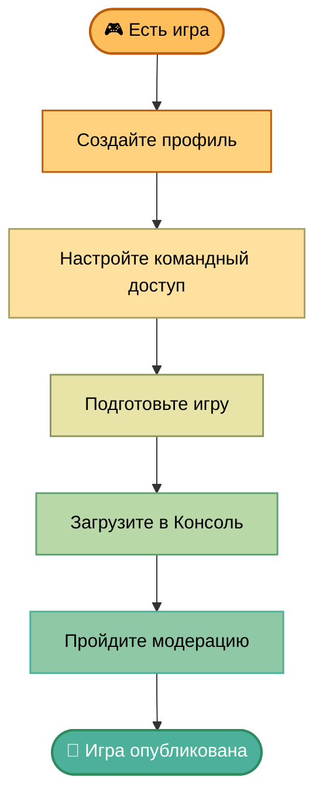

<!-- Источник: https://yandex.ru/dev/games/doc/ru/concepts/quick-start (текст из https://yandex.ru/dev/games/doc/ru/llms-full.txt), скачано 2026-09-26 -->

# Быстрый старт

[Яндекс Игры](https://yandex.ru/games/){.external} — бесплатная платформа для публикации браузерных игр. Вы подключаете SDK, загружаете игру — и она становится доступна миллионам игроков без установки. Мы берем на себя хостинг, авторизацию и монетизацию — вам остается сосредоточиться на игре и ее росте.

Выполните шаги ниже и разместите готовую игру на платформе:

```mermaid
flowchart LR
    Game(["🎮 Есть игра"]) --> S1["Создайте<br/>профиль"]
    S1 --> S2["Настройте<br/>командный<br/>доступ"]
    S2 --> S3["Подготовьте<br/>игру"]
    S3 --> S4["Загрузите<br/>в Консоль"]
    S4 --> S5["Пройдите<br/>модерацию"]
    S5 --> Done(["🚀 Игра<br/>опубликована"])

    click S1 "ru/concepts/quick-start#registration" "Перейти к шагу 1"
    click S2 "ru/concepts/quick-start#team-access" "Перейти к шагу 2"
    click S3 "ru/concepts/quick-start#requirements-sdk" "Перейти к шагу 3"
    click S4 "ru/concepts/quick-start#draft" "Перейти к шагу 4"
    click S5 "ru/concepts/quick-start#moderation" "Перейти к шагу 5"
    click Done "ru/concepts/quick-start#after-publication" "После публикации"

    classDef start fill:#ffbe5c,stroke:#bd5c0a,stroke-width:2px,color:#000;
    classDef step1 fill:#ffd27f,stroke:#bd5c0a,stroke-width:1.5px,color:#000;
    classDef step2 fill:#ffe19f,stroke:#a8a060,stroke-width:1.5px,color:#000;
    classDef step3 fill:#e8e4a8,stroke:#8a9560,stroke-width:1.5px,color:#000;
    classDef step4 fill:#b8d8a8,stroke:#5fa070,stroke-width:1.5px,color:#000;
    classDef step5 fill:#8ec8a4,stroke:#4db09b,stroke-width:1.5px,color:#000;
    classDef finish fill:#4db09b,stroke:#2d8b5d,stroke-width:2px,color:#fff;

    class Game start;
    class S1 step1;
    class S2 step2;
    class S3 step3;
    class S4 step4;
    class S5 step5;
    class Done finish;
```



Сразу переходите к [заполнению черновика](https://yandex.ru/dev/games/doc/console/add-new-game.md#step-create-draft).



## Шаг 1. Зарегистрируйтесь {#registration}

[Консоль разработчика](https://games.yandex.ru/console){.external} — личный кабинет, где вы управляете играми: загружаете билды, настраиваете монетизацию и продвижение, следите за метриками. Регистрация проходит в два этапа: [создание профиля](https://yandex.ru/dev/games/doc/ru/#console) и [заключение договора](https://yandex.ru/dev/games/doc/ru/#partner).

### Создайте профиль {#console}

Профиль дает доступ к Консоли:

1. [Создайте профиль разработчика](https://yandex.ru/dev/games/doc/console/manage-account.md#dev-profile-create). При регистрации используйте Яндекс ID с логином Яндекса.
1. В разделе **Профиль** укажите [Предпочитаемый язык для связи](https://yandex.ru/dev/games/doc/console/manage-account.md#profile-manage). На этом языке мы будем с вами общаться.

С профилем вы можете [добавить игру](https://yandex.ru/dev/games/doc/console/add-new-game.md) и заполнить ее черновик. Но пока не заключен договор, отправить игру на модерацию не получится.

### Заключите договор {#partner}

Договор открывает модерацию и выплаты. Как его заключить, зависит от страны и формы сотрудничества:

- Россия, юридическое лицо или ИП — заключите договор по [единой лицензионной схеме](https://yandex.ru/dev/games/doc/payments.md) прямо в Консоли.
- Остальные случаи — [зарегистрируйтесь](https://yandex.ru/dev/games/doc/console/adv-monetization.md#enable-int-monetization) в Рекламной сети Яндекса:

    1. Создайте аккаунт в [РСЯ](https://partner.yandex.ru/){.external} и примите условия соглашения. Если вы — физическое лицо, зарегистрируйтесь как самозанятый или ИП.
    1. Укажите [реквизиты для выплат](https://partner.yandex.ru/v2/settings/financial/){.external} и актуальные контакты.

## Шаг 2. Настройте командный доступ {#team-access}

Если вы работаете в команде, в разделе [Пользователи и доступ](https://games.yandex.ru/console/linked-accounts){.external} настройте [роли и доступы](https://yandex.ru/dev/games/doc/console/teamwork.md). Другой участник сможет загрузить игру вместо вас.

## Шаг 3. Подготовьте игру {#requirements-sdk}

### Ознакомьтесь с требованиями {#requirements}

Изучите [требования](https://yandex.ru/dev/games/doc/concepts/requirements.md) к игре и промоматериалам — это сэкономит время на модерации.

### Подключите SDK или плагин {#sdk}

SDK открывает доступ к возможностям платформы: помогает добавить рекламу и покупки, сохранять прогресс игрока на сервере Яндекса, менять поведение игры без обновления билда. Без SDK игру опубликовать не получится.

Вы можете подключить SDK:

- [напрямую](https://yandex.ru/dev/games/doc/sdk/sdk-about.md) через код игры;
- с помощью [плагинов](https://yandex.ru/dev/games/doc/sdk.md#official-plugins) для популярных движков.

## Шаг 4. Загрузите игру в Консоль {#draft}

В Консоли разработчика [добавьте игру](https://yandex.ru/dev/games/doc/console/add-new-game.md) и на вкладке **Черновик**:

- загрузите архив с файлами игры на сервер Яндекса;
- укажите, на какие языки локализована игра ([рекомендуемые языки](https://yandex.ru/dev/games/doc/ru/languages-and-domains.md#languages));
- добавьте описания и промоматериалы.

Подробнее о полях черновика см. на странице [Заполнение черновика](https://yandex.ru/dev/games/doc/console/add-new-game/draft.md).

Если в игре есть [инап-покупки](https://yandex.ru/dev/games/doc/console/purchases.md), заранее проверьте [условия их подключения](https://yandex.ru/dev/games/doc/sdk/sdk-purchases.md#conditions) — в некоторых случаях нужно отправить запрос в поддержку.

## Шаг 5. Пройдите модерацию {#moderation}

### Протестируйте игру {#test}

Перед отправкой на проверку [протестируйте игру](https://yandex.ru/dev/games/doc/console/test-game.md) самостоятельно.



#|
|| **Пункт Требований к игре** | **Категория** | **Нарушение** | **Пояснение** ||
|| [1.6.1.8](https://yandex.ru/dev/games/doc/ru/requirements.md#1-6-1-8), [1.6.2.7](https://yandex.ru/dev/games/doc/ru/requirements.md#1-6-2-7) | UI / Интерфейс | Контекстное меню при взаимодействии | При правом клике или долгом нажатии появляется системное контекстное меню браузера — его необходимо отключить в игровой области. ||
|| [1.6.1.6](https://yandex.ru/dev/games/doc/ru/requirements.md#1-6-1-6), [1.6.2.5](https://yandex.ru/dev/games/doc/ru/requirements.md#1-6-2-5) | ^ | Системный плеер (десктоп и мобильные устройства) | Видеоконтент воспроизводится через системный плеер вместо встроенного игрового — нарушает целостность интерфейса. [Подробнее](https://yandex.ru/dev/games/doc/requirements/1/6.md). ||
|| [4.7](https://yandex.ru/dev/games/doc/ru/requirements.md#4-7) | ^ | Звук при показе рекламы не ставится на паузу | Во время показа рекламного ролика звук из игры продолжает играть. Необходимо ставить аудио на паузу на время рекламы. ||
|| [1.3](https://yandex.ru/dev/games/doc/ru/requirements.md#1-3) | ^ | Звук продолжается при переключении вкладки | Музыка или звуки из игры не останавливаются при уходе со вкладки. Необходимо реагировать на потерю фокуса страницы. [Подробнее](https://yandex.ru/dev/games/doc/requirements/1/3.md). ||
|| [1.19.2](https://yandex.ru/dev/games/doc/ru/requirements.md#1-19-2) | SDK / Game Ready | Game Ready работает некорректно | Game Ready подключен, но метод `ysdk.features.LoadingAPI.ready()` вызывается неправильно или в неверный момент жизненного цикла игры. [Подробнее](https://yandex.ru/dev/games/doc/requirements/1/19.md#gameready). ||
|| [2.14](https://yandex.ru/dev/games/doc/ru/requirements.md#2-14) | ^ | Автоопределение языка через SDK не реализовано | Язык интерфейса задается вручную вместо использования `ysdk.environment.i18n.lang`. Игра должна автоматически подстраиваться под язык пользователя. [Подробнее](https://yandex.ru/dev/games/doc/requirements/2/14.md). ||
|| [1.19.2](https://yandex.ru/dev/games/doc/ru/requirements.md#1-19-2) | ^ | Game Ready не используется совсем | Game Ready не интегрирован, хотя обязателен для публикации в каталоге. [Подробнее](https://yandex.ru/dev/games/doc/requirements/1/19.md#gameready). ||
|| [1.1](https://yandex.ru/dev/games/doc/ru/requirements.md#1-1) | ^ | SDK не встроен или встроен некорректно | Скрипт SDK отсутствует, подключен не из официального источника или инициализируется с ошибками. [Подробнее](https://yandex.ru/dev/games/doc/sdk/sdk-about.md#check). ||
|| [1.9](https://yandex.ru/dev/games/doc/ru/requirements.md#1-9) | Технические сбои | Прогресс не сохраняется | Результаты, уровни или настройки не сохраняются между сессиями. Необходимо использовать объект `Player` для хранения данных. [Подробнее](https://yandex.ru/dev/games/doc/requirements/1/9.md). ||
|| [1.14](https://yandex.ru/dev/games/doc/ru/requirements.md#1-14) | ^ | Игра не запускается | Загрузочный экран зависает или игра не доходит до геймплея. Проверьте консоль на ошибки при инициализации. [Подробнее](https://yandex.ru/dev/games/doc/requirements/1/14.md). ||
|| [1.14](https://yandex.ru/dev/games/doc/ru/requirements.md#1-14) | ^ | Ошибка на старте или при действиях | В консоли браузера появляются JS-ошибки при запуске или в ходе игры, которые влияют на работоспособность. [Подробнее](https://yandex.ru/dev/games/doc/requirements/1/14.md). ||
|| [1.15](https://yandex.ru/dev/games/doc/ru/requirements.md#1-15) | ^ | Игра зависает или тормозит | Заметные фризы или падение производительности делают игру некомфортной для пользователя. [Подробнее](https://yandex.ru/dev/games/doc/requirements/1/15.md). ||
|| [2.3](https://yandex.ru/dev/games/doc/ru/requirements.md#2-3) | Соответствие описанию | Игра не соответствует заявленному жанру | Геймплей противоречит выбранной на вкладке **Черновик** [категории](https://yandex.ru/dev/games/doc/console/add-new-game/draft.md#field-category). Жанр и описание должны точно отражать содержание игры. ||
|| [8.2.2](https://yandex.ru/dev/games/doc/ru/requirements.md#8-2-2) | Название игры | Вводящее в заблуждение название | Название содержит слова, которые вводят пользователя в заблуждение относительно условий игры: «free», «top», «best», «бесплатно», «бесплатный» и т. п. ||
|#



### Отправьте на модерацию {#submit}

Отправить игру на модерацию можно только после того, как заключен договор — по [единой лицензионной схеме](https://yandex.ru/dev/games/doc/payments.md) в Консоли или в [РСЯ](https://partner.yandex.ru/){.external}. Если договора нет, заполните [вторую анкету](https://partner.yandex.ru/v2/settings/financial/){.external} и подождите, пока акцептуют вашу оферту. Обычно срок проверки документов составляет три рабочих дня.

На вкладке **Черновик** нажмите **Отправить на модерацию** — игра перейдет в статус **Ожидает модерации**. Если хотите сами выбрать время релиза, заранее включите опцию [Отсроченная публикация](https://yandex.ru/dev/games/doc/console/add-new-game/draft.md#field-delay).

Игру проверят на соответствие [требованиям](https://yandex.ru/dev/games/doc/ru/requirements.md). Обычно [модерация](https://yandex.ru/dev/games/doc/ru/moderation.md) занимает 3–5 рабочих дней.



Результаты проверки вы увидите в [Консоли](https://games.yandex.ru/console){.external}:

- Если модерация одобрит игру, статус изменится на:

  - **Опубликовано**: игра опубликуется автоматически.
  - **Проверен**, если включена опция **Отсроченная публикация**. На вкладке **Черновик** появится кнопка **Опубликовать**.

- Если в публикации откажут, статус изменится на **Отклонен**. Причины придут на почту, указанную в [профиле разработчика](https://yandex.ru/dev/games/doc/console/manage-account.md#profile-manage).



Единовременно можно отправить не больше двух заявок на публикацию новых игр. Чтобы отправить на модерацию третью игру, дождитесь решения по одной из текущих заявок или отзовите одну из них самостоятельно.

Ограничение не распространяется на обновления уже опубликованных игр.

## После публикации {#after-publication}

- Неделю игра будет в разделе [Новые](https://yandex.ru/dev/games/doc/ru/ranking-and-featuring.md#new-category) и ML-алгоритмы определят для нее подходящую аудиторию.
- Через две недели на карточке появится [рейтинг](https://yandex.ru/dev/games/doc/ru/metric.md#product) вовлечения и удержания игроков.

Дальше — [оперирование](https://yandex.ru/dev/games/doc/liveops.md): метрики, A/B-тесты и работа с аудиторией.
